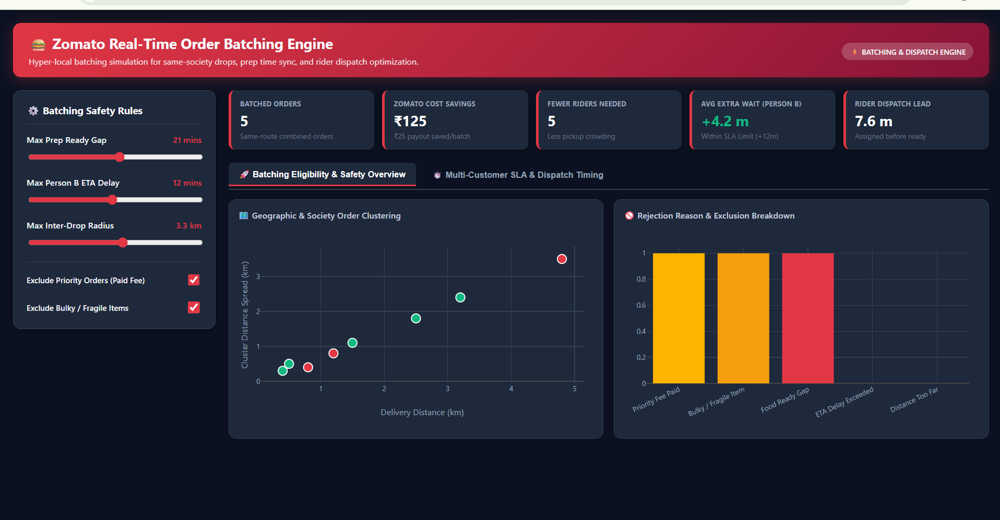

# 🍔 Zomato Order Batching Decision Engine

> **One question, answered with data:** when two food orders can share one delivery rider, and when they should *not*.

[](https://vaishnavi698.github.io/Zomato-Order-Batching-Analysis/)
[](https://github.com/Vaishnavi698/Zomato-Order-Batching-Analysis)

👉 **Try it now (no install needed):** https://vaishnavi698.github.io/Zomato-Order-Batching-Analysis/


*The live dashboard: safety-rule controls, KPI cards and charts in one view.*

---

## 📖 Contents
1. [The problem in plain English](#-the-problem-in-plain-english)
2. [What this project does](#-what-this-project-does)
3. [How a batching decision is made](#-how-a-batching-decision-is-made)
4. [Who benefits](#-who-benefits)
5. [What the dashboard shows](#-what-the-dashboard-shows)
6. [Sample results](#-sample-results)
7. [How to run it](#-how-to-run-it)
8. [Tools used](#-tools-used)
9. [Full analysis notes](#-full-analysis-notes)
10. [About me](#-about-me)

---

## 🧩 The problem in plain English

Imagine **Priya (Flat 201)** and **Rahul (Flat 805)** live in the **same society**. Both order from **the same Burger King** at almost the same time.

| Without batching | With batching |
|---|---|
| Rider 1 → Priya | Rider 1 → Priya → Rahul |
| Rider 2 → Rahul | *(one rider, one trip)* |
| **2 riders, 2 payouts** | **1 rider, 1 payout + a small bonus** |

Sounds like an easy win, but **blindly batching everything is a bad idea**:

- Rahul might wait **much longer** for his food ❌
- The second order might **not be ready yet** while the rider waits ❌
- Two big orders (say 3 cakes + 5 kg biryani) **can't safely fit in one bag** and can spill ❌
- A customer who **paid extra for priority delivery** was promised speed ❌

So the real question is:

> **"Given two or more active orders, should Zomato batch them or send separate riders?"**

---

## 🎯 What this project does

It builds a **decision engine** that checks every pair of orders against a set of safety rules and labels each one as either:

- ✅ **Eligible to batch**, or
- ❌ **Rejected**, with the exact reason

Then it calculates **how much money is saved** and **how much extra waiting** the second customer faces.

---

## 🧠 How a batching decision is made

Every order pair goes through four simple questions:

```
1️⃣ Can these orders be batched?
   Same restaurant · customers nearby · food ready around the same time
   · not a priority order · not bulky or fragile
            ↓
2️⃣ Will batching make someone wait too long?
   Compare normal delivery time vs. batched delivery time
            ↓
3️⃣ Is it actually cheaper?
   Cost of 2 separate riders  −  Cost of 1 rider + bonus
            ↓
4️⃣ What is the overall impact?
   Orders batched · money saved · extra wait · reasons for rejection
```

### The safety rules (all adjustable in the dashboard)

| Rule | Default | Why it matters |
|---|---|---|
| **Max prep-ready gap** | 15 min | Don't make a rider wait ages for the second order |
| **Max extra delay for 2nd customer** | 5 min | Keep the second customer happy |
| **Max distance between drops** | 3 km | Customers must be close for one trip to make sense |
| **Exclude priority orders** | On | Customers who paid a fast-delivery fee are never batched |
| **Exclude bulky / fragile items** | On | Cakes, large biryani orders etc. travel alone |

---

## 🤝 Who benefits

| | Benefit |
|---|---|
| 🏢 **Zomato** | Pays one rider instead of two → lower delivery cost |
| 🛵 **Rider** | Two deliveries in one trip → extra incentive, no extra travelling |
| 🍟 **Restaurant** | Fewer riders crowding the counter during busy hours |
| 🙋 **Customer** | Delay stays inside a small, controlled limit |

---

## 📊 What the dashboard shows

Open the [live demo](https://vaishnavi698.github.io/Zomato-Order-Batching-Analysis/) and you can:

- **Change the safety rules** (prep gap, extra delay, distance) and instantly see how results change
- Switch **priority** and **bulky/fragile** exclusions on or off
- See **top KPI cards**: batched orders, money saved, fewer riders needed, average extra wait, rider dispatch lead time
- Explore charts for:
  - 🗺️ Orders clustered by society / area
  - 🚫 Why orders were rejected (priority, bulky, distance, time…)
  - ⏱️ Second customer's extra wait vs. the allowed limit
  - 🛵 How many minutes **before food is ready** the rider gets assigned


*Delivery-time (SLA) and rider dispatch timing: how long the second customer waits, and how early the rider is assigned.*

---

## 📈 Sample results

On the demo's **sample data** with default rules:

| Metric | Result |
|---|---|
| Orders batched | **4** |
| Money saved for Zomato | **₹100** (about ₹25 per batch) |
| Riders no longer needed | **4** |
| Average extra wait for the 2nd customer | **+2.5 min** (limit is +5 min) |
| Rider assigned before food is ready | **5.5 min** ahead |

> ℹ️ The data here is a small **sample dataset built to demonstrate the logic**, not real Zomato data. The numbers show *how the engine works*, not Zomato's actual savings.

---

## ▶️ How to run it

**Easiest way:** just open the [live demo](https://vaishnavi698.github.io/Zomato-Order-Batching-Analysis/).

**Run it on your computer:**

```bash
# 1. Download the project
git clone https://github.com/Vaishnavi698/Zomato-Order-Batching-Analysis.git
cd Zomato-Order-Batching-Analysis

# 2. Install what it needs
pip install -r requirements.txt

# 3. Run the data pipeline (applies the batching rules with SQL)
python etl_pipeline.py

# 4. See the dashboard: open index.html in your browser
```

---

## 📁 What's in this repo

| File / folder | What it is |
|---|---|
| `index.html` | The interactive dashboard (also the live demo) |
| `etl_pipeline.py` | Runs the SQL batching rules and labels every order |
| `app.py` | <!-- TODO: add one line describing what app.py does --> Application file |
| `images/` | Screenshots used in this README |
| `data/` | Sample order data |
| `src/` | Supporting source code |
| `requirements.txt` | Python packages needed |

---

## 🛠️ Tools used

**Python** · **SQL** (run through Python's built-in SQLite) · **HTML / JavaScript dashboard** · **GitHub Pages** (free hosting for the live demo)

---

## 📚 Full analysis notes

Want to see **how I thought about the problem**, all the constraints, the business logic and the metrics?
👉 Read [`docs/PROJECT_DETAILS.md`](docs/PROJECT_DETAILS.md)

---

## 🔮 Ideas for the future

- Batch **more than two** orders per rider
- Use **real road distance** instead of straight-line distance
- Add **item-size classes** (small / medium / large) for smarter bag-fit checks
- Test batching rules on **real order data**

---

## 👩‍💻 About me

**Vaishnavi Gupta**, aspiring Data Analyst · New Delhi, India

[LinkedIn](https://www.linkedin.com/in/vaishnavi-gupta-0a8076213/) · [GitHub](https://github.com/Vaishnavi698) · [LeetCode](https://leetcode.com/u/Vaishnavi-guptaa) · vaishnavigupta97929@gmail.com

⭐ If you found this useful, please star the repo!
